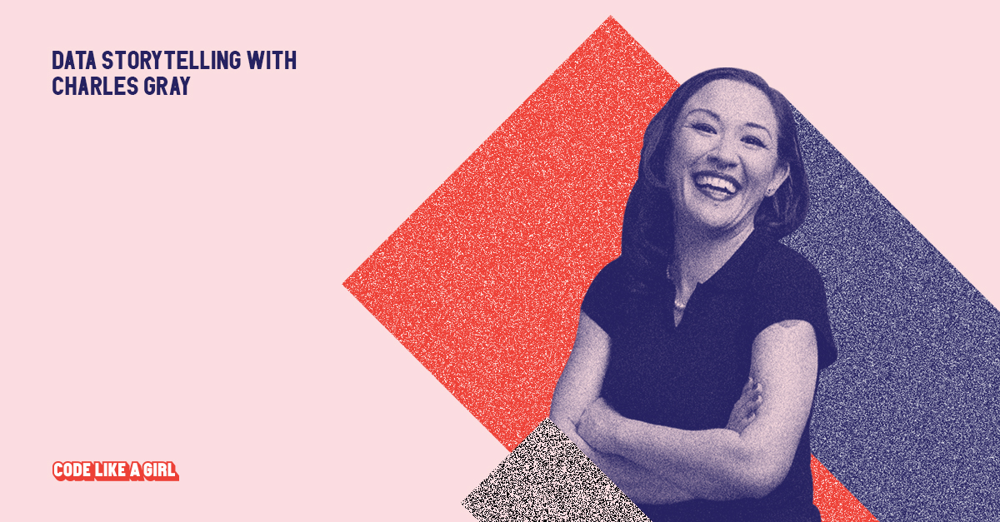

### CV | Resume

**Charles T. Gray, PhD** (She/her)

Senior Data Strategist | Infrastructure Consultant | FAIR Data Advocate  

Copenhagen, Denmark | charlestigray@gmail.com | (+45) 55 23 61 68  

[LinkedIn](https://www.linkedin.com/in/charles-t-gray/) | [GitHub](https://github.com/softloud) | [Website](https://softloud.github.io/good-enough/)| [Publications](https://scholar.google.com/citations?user=7ZGTepkAAAAJ&hl=en) | [Coding portfolio](https://softloud.github.io/good-enough/research/research.html#code) | [Bio](https://softloud.github.io/good-enough/lab.html#dr-charles-t.-gray-cto-datapunk-founder)   

---

---

### Professional Summary
Data architecture and research infrastructure expert with 15+ years of experience spanning statistical computing, open science, and enterprise analytics. I specialise in designing **reproducible, testable, and reusable data systems and data visualisation that tells meaningful stories** — as well as navigating the organisational change needed to support automation. Whether advocating for FAIR principles or replacing tangled spreadsheet ecosystems with semantic models and observability, I focus on building **long-term value, not hype**. I’m seeking roles that recognise data architecture as strategy, not a solo heroic act.

---

### Career Highlights
- ✨ **Heidelberg Laureate Forum Featured Scientist** — selected for combining mathematics, music, and storytelling at one of the world's most prestigious scientific gatherings.
- 🎤 **Keynote speaker** at World Science Festival and Melbourne Writers Festival & the Australian Mathematical Sciences Institute [Choose Maths](https://www.youtube.com/watch?v=o0Rqz8Hgacc) campagin — known for communicating technical concepts with clarity and passion.
- 🧹 **Built entire data stack** (DBT, SQL, Python, Tableau) solo for mobile gaming company — from semantic marts to custom observability macros to Tableau dashboards reporting KPIs, telemetry, & player behaviour analytics.
- 🚀 **Led ESG data strategy** in enterprise context — proposed FAIR-aligned infrastructure to support long-term sustainability metrics.
- 📈 **Simulated robust pipelines** for statistical inference in academic research (h-index 10) — now [widely cited](https://scholar.google.com/citations?user=7ZGTepkAAAAJ&hl=en) in open science circles.

---

### Professional Experience

**Senior Data & Infrastructure Consultant**  
*Freelance / Contract Roles — 2019–Present*

- Led end-to-end **data architecture projects** using DBT, Dagster, Redshift, Snowflake, PowerBI, Tableau, R, and Python — from raw ingestion to semantic layer.
- Advocated and implemented **governance-first approaches**: versioned simulation pipelines, testing macros, CI/CD for data models.
- Served as **de facto product manager** in multiple roles — scoping, delivering, and aligning technical vision with business outcomes.
- Navigated complex environments (including ESG reporting) where technical change required **organisational alignment**.
- Consulted on **open science infrastructure**: reproducibility, FAIR workflows, and long-term research data stewardship.

**Research Software Engineer & Lecturer**  
*University & Research Institutions — 2012–2019*

- Designed **hierarchical Bayesian modelling pipelines** for large-scale evidence synthesis.
- Taught and developed curricula for courses in **statistical computing, algorithms, data visualisation, and meta-analysis**.
- Built and maintained **simulation workflows** for exploring statistical estimator performance under varied conditions.
- Advocated for and implemented reproducible practices in interdisciplinary scientific teams.

---

### Selected Speaking & Community Leadership
- **Invited Speaker** — DBT Meetup Copenhagen, PyData Copenhagen, useR Group
- **Mentor/Consultant/Organiser** — Code Like a Girl, R-Ladies Global, Women in Data & Analytics Nordics, and many women in STEM initiatives
- **Featured In** — Various magazines and newpapers: *Womanthology* magazine, Australian Mathematical Sciences Institute *Choose Maths* campaign

---

### Skills
**Infrastructure & Engineering:** DBT, Dagster, SQL, Redshift, Snowflake, Azure, Python, R  
**Data Strategy & Governance:** Semantic modelling, observability, data testing, documentation workflows  
**Collaboration & Delivery:** Git, Jira, Monday, Clilckup, Agile, technical product management  
**Reproducibility & Open Science:** R Markdown, Quarto, Targets, FAIR workflows  
**Communication:** Data storytelling, technical writing, cross-team leadership

---

### Education
**Ph.D., Statistics** — La Trobe University, Australia (2015–2020)  
*Focus: Simulation, estimator pipelines, computational metascience*  

**B.Sc. (First Class Hons), Mathematics & Statistics** — La Trobe University (2011–2015)  
**B.A./B.Mus., Cinema Studies & Musicology** — University of Melbourne (2001–2007)

---

### Approach to Data Leadership
> I believe data architecture is inherently **collaborative, strategic, and cultural**. The best pipelines mean little without shared understanding, version control, testing, and documentation. I work best in teams that value **infrastructure as a long-term investment**, not a quick fix.

